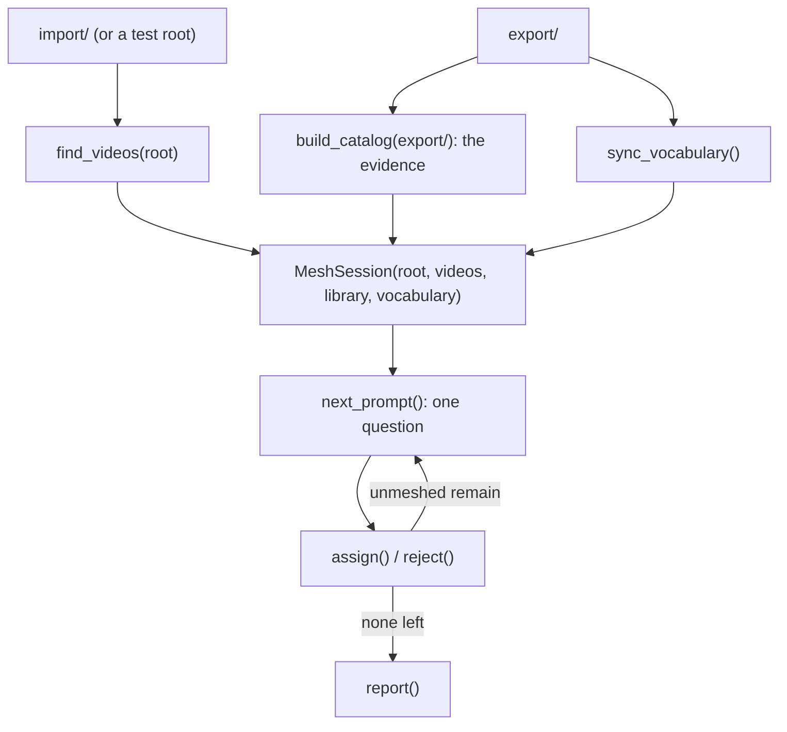

"""Bringing somebody else's finished clips into this library.

Applies to: `shared/importing.py`, `shared/exporting.py`, `shared/catalog.py`,
`shared/records.py`, `shared/sources.py`, `shared/paths.py`, `shared/mesh.py`,
`importer/mesh.py`, `importer/meshwindow.ui`.

This document covers the importer's **backend**. There is no window yet: nothing
displays a catalog, a proposal, or an import result. What is here is every
function a window will need, and the four decisions that shape them.

## The shape of it

A finished clip is not a segment of a compilation, so it cannot arrive through
`shared/exporting.py:plan_export`, which plans segments. What it *is* is already
somebody else's answer to the same question — where does a clip with these tags go
— so the answer is read out of their `.cnfo` and the planning is done through the
identical rules.

Two modes, and the difference is only where the tags came from.

**Tagged.** `build_catalog(root)` walks a folder and reads the clips it holds;
`candidates_from_catalog(...)` turns them into `ImportCandidate`s;
`plan_import(...)` resolves them to destinations; `execute_import(...)` writes
them. No ffmpeg runs at any point: `ClipRecord` carries `duration`, so the new
record is rendered from the old one and there is nothing to probe.

**Untagged.** There is no record, so somebody has to supply the tags. That
somebody is a person, and [the Mesh Wizard](#the-library-mesh-wizard) is how it
happens.

`import/` is the folder to read from, and `export/` is where the results land.

## The four decisions

These were settled while planning and each is worth knowing before changing any
of them.

### A foreign record is refused, not half-read

`shared/records.py` refuses a record holding a tag key this build does not know,
which was its behaviour before the importer existed and stays. For a record commcut
itself wrote, that is right — it means the record is corrupt. For a record from
somebody else's install it means "this build lacks that tag", which is a different
thing with the same symptom.

The importer does not loosen the reader. Instead it makes the refusal *usable*:
`CatalogProblem` carries a `reason` code beside its message, so a screen can group
a library's problems instead of showing the user four hundred sentences that all
say something is wrong. The codes come from `shared.records.record_error_reason`,
which classifies the raised message and is pinned per-branch by
`tests/test_records.py` so a reworded message fails a test rather than silently
changing a code.

### `<source>` is the imported file's name

`ClipRecord.source` is required to be a non-empty string, and an imported clip was
never cut from a compilation. Nothing in the app reads the field for logic — it is
written, checked, parsed, and asserted in tests — so it carries one honest value
under two readings: the compilation a clip was cut from, or the file it was
imported as. No schema bump, so every existing commcut still reads the output.

The alternative was a version 2 schema with explicit provenance. It was declined
because `parse_record_xml` refuses both unrecognized elements *and* versions above
the current one, so a v2 record is unreadable by every older commcut — a hard
compatibility wall, for a field no code reads.

### An occupied destination is skipped or refused, never clobbered

Export refuses any destination that already exists, which is right for a clip the
user is looking at. For an import it is wrong: the second run of an import has to
be a no-op rather than a failure, or the operation cannot be retried after a
partial cancellation.

So `plan_import` takes the destination library and decides per clip:

- taken, and the record already there carries **the same tags** → **skipped** as
  already present. `ImportPlan.already_present`.
- taken, anything else → **refused by name**, naming the tags that differ.
  `ImportPlan.refusals`.

Two details that are easy to get wrong:

- The comparison is against the **whole** tag dict, both directions. Comparing only
  the incoming tags would call an existing clip carrying a tag this one lacks
  "already present", and quietly keep the poorer copy of the pair.
- Destinations are matched in `DestinationIndex`'s **normalized key space**, never
  with `==`. On a case-insensitive volume `cartoon network/A Clip.mp4` and
  `Cartoon Network/A Clip.mp4` are one file, and string comparison would let the
  incoming clip overwrite the existing one — the single outcome worse than a
  refusal.

Worth knowing: with the **shipped** schemes a same-destination conflict is nearly
unreachable, because all ten tags appear in the filename and differing in any of
them changes the path. A conflict needs either a custom scheme that leaves a tag
out, or a sanitation collision (`A/B` and `A:B` both becoming `A-B`). Both are
real; neither is common.

### One bad clip does not take the batch down

`preflight_export_plan` refuses the *whole* batch on any problem, and that is
correct: a Stage or an Export is one clip the user is looking at. An import of
somebody else's eight hundred clips is a different operation, and one record
missing Time Period should cost one clip rather than all of them. `plan_import` is
therefore per-clip, and every skip is carried by name in `ImportPlan.skipped` with
a `reason` code and a sentence.

The price is that a partial import has to be **reported** rather than raised,
which is what `ImportSkip` is and why `ImportResult` is three lists rather than a
count.

Note that invariant 10 (editing writes are all-or-nothing) governs Stage and
Export, and does not reach here.

## Planning

```python
plan_import(candidates, schemes, export_root, *,
            transfer=TRANSFER_COPY, existing=None) -> ImportPlan
```

`schemes` and `export_root` are the same arguments `plan_export` takes, and the
destination is resolved through the **shared** helpers rather than a second copy:
`plan_clip_destination` (canonicalize tags → required-tag rule → both schemes →
sanitation → UTF-8 byte ceiling) and `DestinationIndex` (the skip set and the
cross-clip collision map). Invariant 9 would otherwise forbid the fork, and the
one thing an importer must not get wrong is putting a foreign clip somewhere an
exported one would not go. `tests/test_exporting.py` pins both halves, including
a cross-check that the two planners agree on a path.

`PlannedExportClip` is reused **as-is**, wrapped by `PlannedImportClip`. Its
`segment_index` and `start` carry no meaning for an import and are left at their
defaults rather than given invented values — which is also what the new record
gets, since an imported clip was not cut from a segment.

## Executing

```python
execute_import(plan, on_progress=None, should_cancel=None) -> ImportResult
```

- **`transfer`** is `copy` (the default), `link`, or `move`. `copy` is the only one
  safe to assume: `move` destroys the user's media if the run is cancelled or a tag
  is wrong, and `link` is not always available — exFAT and FAT32 have no hard
  links, and a link cannot cross a volume, so `link` **falls back to a copy per
  clip** rather than failing the batch. The parameter rather than a radio button is
  deliberate: the backend is complete for all three before there is a screen to
  choose between them.
- **`check_free_space`** refuses a copying import that does not fit, once, naming
  the shortfall, before the first clip. No precedent for this existed:
  `preflight_export_plan` measures *path length* in UTF-8 bytes, not free space.
  A run of eight hundred copies that dies on clip four hundred leaves the user to
  work out which half arrived. `link` and `move` need no check.
- **A cancelled run keeps everything it committed** and says so. That is the same
  rule the export follows, and the reason `already_present` is part of *planning*
  rather than something a caller arranges: re-planning the same folder after a
  cancellation skips what landed and finishes the rest.
- **The record is published before the video is committed**, and both go through a
  temporary file in the destination directory first. That ordering keeps invariant
  12 — `video present` implies `record present` — true at every instant a reader
  could observe, including the one where the process is killed mid-run. It is the
  *reverse* of the export's order and for the same reason: there the encode is the
  long part and the record identifies it; here the file copy is.
- If the record cannot be written after the video landed, **the video is removed
  again.** A clip with no record reads as a stray file, and a dangling record reads
  as a clip that exists; neither state is one the invariant allows.
- One failing clip does not stop the run. Its destination is left clean and it goes
  in `ImportResult.failed` with its reason.

No child process runs, so `no_console_kwargs` has nothing to do here — copying,
linking and moving are all filesystem operations.

## Untagged discovery

`find_videos(root)` is the deliberate inverse of `build_catalog`, which yields only
clips a record backs. That rule is right for a library this app maintains and
useless for a folder of somebody's rips, where the absence of a record is the normal
case rather than a sign of corruption.

Traversal is otherwise identical to the catalog's — `os.walk`,
`followlinks=False`, a missing root is empty rather than an error, `on_progress`
carrying no total — because one traversal rule in this app is worth more than two
that differ. The one deliberate difference: **a directory that cannot be read is
not descended into**, where the catalog reports it. A half-readable folder is the
normal state of a folder someone has been filling by hand for years, and a walk
that refused to return anything at all because of one bad subfolder would be
useless.

Videos that *do* have a sibling record are still listed, with `has_record=True`, so
a caller can hand them to the tagged path rather than making the user decide which
half they are in.

## Proposals, and why they are gone

This document used to describe `shared/importing.py:propose_tags_from_path`, which
read folder names, ` - ` separators and parenthetical groups out of a path and
offered them as `TagProposal`s with a confidence level.

**It has been removed.** The Wizard does not need it — its inputs are folder names,
which are already extracted, and a folder is called what it is called — so the
function had no caller. Filename parsing was the part that would have *inferred*
rather than asked, and `docs/naming-and-organization.md` refuses that outright: a
scheme renders lossily, so a name cannot be read back into tags.

Leaving unused code "for later" would have been the wrong call. If filename parsing
is ever wanted it belongs in a separate pass, written with real examples in hand,
and it would have to ask rather than suggest. The rule that survives is narrower
and stronger: **a folder name becomes a tag only through
`MeshSession.assign`**, and the type boundary is what stops that happening by
accident.

`match_value` did survive, because the Wizard's value question needs its ranked,
counted evidence — see below.

## Evidence for the value question

`match_value(value, library, vocabulary)` returns `ValueMatch`es ranked by evidence
rather than choosing one. Showing "block (14 clips), special (2)" makes a namespace
choice a click; choosing silently is how a library ends up with fourteen clips under
`block` and one under `special`.

The Wizard sets its suggested namespace from this **only when there is exactly one
match** — "if Toonami is only present in the block namespace, assume it is a block"
— and with two candidates it suggests neither, because picking either is the guess
the Wizard exists to prevent.

`in_library` and `in_vocabulary` are separate columns because they are different
kinds of knowing: the library is what the user has, and `vocabulary.json` is a hint
that survives a clip being deleted — the file is a cache *downstream* of the library
and drifts. A hit only in the file is weaker evidence and is marked as such.

An empty result is **not** permission to guess. It means the value is new here, and
the caller has to ask.

## The Library Mesh Wizard

An untagged library tells you almost nothing about its clips, and the one thing it
does tell you is the folder names. `Cartoon Network/2000s/Promo/` says a network, a
period and a kind; that is three tags' worth of information and it is *exactly*
three tags' worth. The Wizard (`shared/mesh.py` over `importer/meshwindow.ui`) is
how a person turns them into tags, one question at a time. Reached from the main
menu's **Import** button, and standalone: it produces a table of decisions and
imports nothing.



### The safety property, and how it is enforced

> A folder name becomes a tag **only** because a person chose a namespace and a
> value for it. Nothing infers anything.

That is structural rather than editorial. `MeshSession` starts with every entry
`unmeshed`, and only `assign` or `reject` changes that — there is no code path that
fills the table without an explicit call. A folder name that matches the library
exactly is a *suggestion* the screen pre-selects, and the user still presses
Assign. `tests/test_mesh.py::test_a_fresh_session_is_empty_even_when_every_name_matches_exactly`
is the test that fails if anyone adds a defaulting shortcut.

The nearest neighbour of the forbidden reverse parser
([above](#the-two-modes)) is this module, and the distinction is worth stating
plainly: the result is a **user-authored mapping**, consulted only to apply a
decision its author made. Nothing here reads a name and concludes a tag.

**Folder names only.** A filename contributes nothing — `Toonami Blocks/Worlds
Finest.mp4` asks about `Toonami Blocks` and never mentions the file. Parsing
filenames was built and then removed rather than left unused: it was the one place
that would have inferred rather than asked, and it belongs in a later "advanced"
pass written with real examples in hand.

### One name, one decision

The table is keyed by folder **name**. `CN` in forty folders is one answer applying
to all of them, and that is what makes the alias idea work: a user whose own
convention is `CN` can say so once. A *path* is needed for display only — context,
not identity.

Once a name is meshed or rejected it never comes back. `pending()` is derived from
state, so there is nothing to forget and nothing to reconcile.

### Sequencing

`next_prompt()` picks the path with the **most un-meshed names**, and within it the
**leftmost** one. Most-first rather than depth-first because a path whose names are
all decided teaches nothing and a path with five open questions is the one worth
showing; leftmost-first because `network/Cartoon Network` should be decided before
`network/Cartoon Network/2000s`, since a user who has just called the outer folder
a network has the context to answer for the inner one. Ties break on the sorted
path, so a session is reproducible.

`MeshPrompt` is a plain value carrying the path's segments with a colour and a
state each, a suggested namespace, and the ranked values. The window renders it and
makes no decisions of its own, which is why `tests/test_mesh.py` *is* the design.

**Colour** is assigned by first appearance in sorted order, **not** by hashing:
Python salts `hash()` per process, so a hash-derived colour would change between
runs for no reason the user could see.

### Conflicts

Two folder names can put **two values for one namespace in front of one clip** —
and only when they appear in the *same* folder path. `Up Next/Promo/A.mp4` where
both folders mean `filler_type` is the case, because that clip has nowhere to put
two values and a record holds one.

It is emphatically **not** about a namespace being used twice. A library with
`Promo/`, `Bumper/`, `Cartoon/`, `PSA/` and `Billboard/` folders all meaning
`filler_type` is the shape of every real library, no clip ever sees two of them at
once, and nothing is reported. The test is co-occurrence, and the check asks
whether the two names *can* share a path rather than whether they *do*.

That distinction is not cosmetic. An earlier version compared two folder names
globally and warned on every second `filler_type` folder in a library — a warning
that fires on the normal case is dismissed reflexively, which is the worst
possible fate for the one case that matters.

**Nobody guesses.** Where a namespace is claimed twice on one path,
`tags_for` takes **neither** value. Shallowest-wins and deepest-wins both write an
arbitrary choice — decided by folder order — into the same record a deliberate tag
would go in, where nothing later can tell them apart. So instead:

- the contested namespace is **absent** from `ResolvedTags.tags`
- `resolved` is `False`, and `needs_manual_edit` says so the way the queue will
- the tags that *were* decided are still there, so an edit screen can prefill
  everything settled and ask about only the one that is not

`preview_conflict()` answers without mutating, so the window can ask before
committing — "Mesh it anyway?" is only a meaningful question if declining leaves
the table as it was. The dialog is titled by consequence (*"One clip would get two
values for one tag"*) and names a path where it happens, because a message about a
folder *claiming* a namespace reads as though a namespace were something a folder
takes, which is the opposite of what the rest of the model says.

`affected_paths()` reports each distinct collision once with a count of the clips
it reaches, so one mistyped folder name is a sentence rather than a scrollback.

### Reject

`REJECTED` means "this folder name is not a tag". Its videos still import; they
simply contribute nothing from that segment. It is a distinct state from
`unmeshed` because it is a *decision*, and distinct from the Manual Edit queue
because that is not built — the state exists so adding it is not a redesign.

### The vocabulary sync runs on open, and says so

`sync_vocabulary` **prunes** values no clip uses, so it cannot happen invisibly in
a constructor — the user opens a wizard to look around and must not lose a tag they
typed without being told. It runs when the window opens, and its summary is shown
while the user answers, together with any library records that could not be read,
**grouped by reason**: a friend exporting with a tag this build does not know is a
different problem from a corrupt file.

All of it — the sync, the import-folder walk and the library walk — is one worker,
because the library is a network share as often as it is a local folder.

### The table, and why it is in memory

`AliasTable` is the session's output: every decision, meshed or rejected, with a
`to_dict`/`from_dict` and a schema version. Nothing writes it yet, so re-running
asks the same questions again — which is the honest state while the design is still
settling, and the shape is settled so persistence is a later additive change.

`AliasEntry.paths` — how many videos a decision affected — is deliberately **not**
serialized. It is recomputed from the tree every run, so persisting it would freeze
a number that goes stale the moment a folder moves.

### The Library Mesh Tag Editor

The queue, reached from the Wizard's report with **Tag the Titles Next**. It is
the whole of untagged import's back half.

**Why every clip is visited.** A title is not *underivable* — the filename is
perfectly good title material. It is a **region** of a string that also contains
other tags: `Toonami - 30 Sec - Cartoon (Remastered)` has four tokens and no
boundaries. Everything else in the design is a **whole token** — a folder name is
exactly itself, a rule is a substring the user named — and whole tokens automate.
So every clip needs a person exactly once, to supply the one thing the machine
cannot separate.

This is also why the "auto import and fix up the rest" options are **retired**
rather than merely unused: no clip can be finished without a title, so there is
nothing for them to import.

**A settled clip's `.cnfo` is written to `import/` immediately.** The tagged
import then takes over unchanged, so the untagged path converges on the tagged
one rather than forking it. Two consequences:

- **Resume asks `missing_required_tags(record)`, not "is there a record".** A
  clip the user tagged and then abandoned has a record with three of four tags.
  Treating that as finished would strand the clip forever, and it is the single
  most likely way a resume gets this wrong.
- An eight-hundred-clip session has a save point per clip.

**The record is `.cnfo`, not `.cmct`.** `shared/segments.sidecar_path` is the
editor's in-progress boundary model; an imported clip's record is the one the
export planner publishes, which is what `build_catalog` looks for.

**`<source>` is the imported file's own name.** An imported clip was never cut
from a compilation, and one honest value under the field's single reading beats a
schema bump that would make the record unreadable to every older commcut.

**Skip - Delete removes the file.** `import/` is a staging folder, not a library:
anything in it is a copy from somewhere else or expendable. So there is a
destructive option, and it is labelled as one, confirmed with the file's name and
the consequence in words, kept off `Next`'s side of the button row, and never a
default button. Progress counts what is *left*, so a deletion decrements the
denominator instead of looking like a stalled queue.

**An unprobeable clip is not a skip.** No duration means no record, so it cannot
be finished — but it stays in `import/`, is named in the report with the reason,
and comes back next run. It does not block the others. The two skips are opposites
and the report keeps them apart.

**`scan_keyframes` is never called.** A queue has no segments to mark and its
clips are thirty seconds long, so an ffprobe pass over every frame is pure waste.

**The duration probe runs on a thread that has to be told to stop.** One ffprobe
per clip, started as the clip is shown, so `Plan Import` never waits on one.
`ProbeWorker.run()` emits `finished` at the end of every path, `_start_probe`
connects that to `thread.quit`, and the teardown hangs off `thread.finished` —
not off the worker's own signal, which is emitted from inside the still-running
thread. That is what lets `closeEvent` refuse to close while a probe is in flight
and still come off afterwards. See
[architecture.md](architecture.md#ending-a-worker-thread).

### The rules, and why the title is what is left

An autofill rule teaches commcut that a piece of a file name means a tag. Rules
live in the Wizard's own table keyed by the literal string, which is the reason
the modal looks the way it does:

- **A literal already in the table is refused**, and the existing entry comes back
  so the modal can offer to edit it. One literal, one meaning, always. Without
  that, a folder named `30 Sec` meshed to `length:Short` and a rule later typed
  for `30 Sec` would silently disagree, and neither would know about the other.
- **Every match contributes**, not just the first: `Toonami - 30 Sec` with rules
  for both is two tags, and stopping at the first would make the rules an ordered
  list rather than a set.
- **The namespace and value pickers are the Wizard's**, pre-selected from
  `match_value` — so typing `Toonami` offers `block (14 clips)` with the
  evidence attached. One table means one vocabulary.
- **A rule may not target `title`**, and the modal's namespace list does not even
  offer it. A rule is a standing instruction; a title is unique per clip. This
  is the whole reason the title is the one tag still asked for, and it is why the
  editor keeps Title out of its suggested and lockable fields too.

`MeshSession.tags_for_clip` is the operation the queue wants, and it exists
rather than leaving the caller to add the two halves: **the collision rule has to
span both sources.** Neither `tags_for` (folders) nor `tags_for_filename` (rules)
sees the other's contributions, so a caller merging two resolved dicts would
silently pick a winner. One `accumulate` over both, so the answer is the same as
if they had been collected together.

### The tag form is one widget

`shared/tag_form.py` and `shared/tagform.ui` hold the ten fields, and both
windows host that widget. Two tag forms would be two dropdown configurations,
and `docs/tag-vocabulary.md` records why each setting there is load-bearing: the
insert policy, the completer's case sensitivity, its filter mode, its completion
mode. The queue hides the lock buttons rather than omitting them — a lock carries
a value to the next segment, and a queue has no next segment.